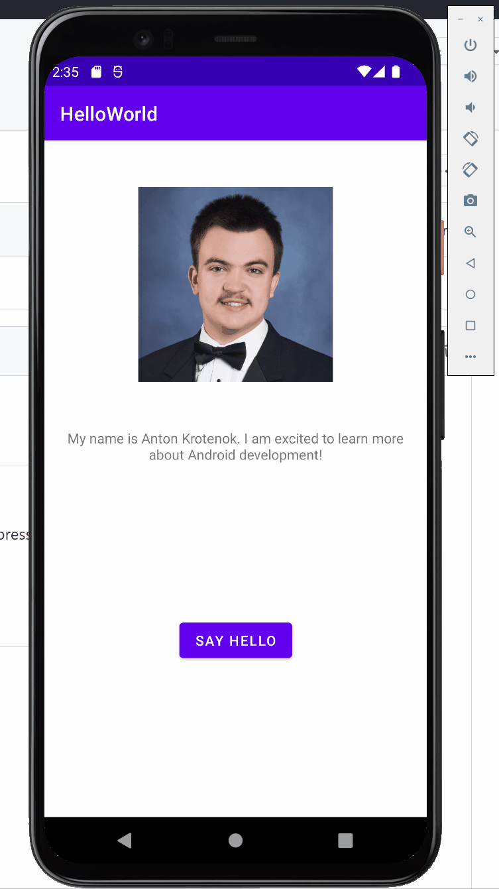

# Android Prework - *Hello World*

Submitted by: **Anton Krotenok**

**HelloWorld** is an android app that shows an image and introductory message, and allows pressing a button to display a Toast. 

Time spent: **5** hours spent in total

## Required Features

The following **required** functionality is completed:

* [X] Image and introductory message displayed on screen
* [X] Button displayed on screen
* [X] Toast with message appears when button is pressed 

The following **optional** features are implemented:

* [ ] List anything else that you can get done to improve the app functionality!

## Video Walkthrough

Here's a walkthrough of implemented features:

<!-- Replace this with whatever GIF tool you used! -->
GIF created with ...  ScreenToGif
<!-- Recommended tools:
[Kap](https://getkap.co/) for macOS
[ScreenToGif](https://www.screentogif.com/) for Windows
[peek](https://github.com/phw/peek) for Linux. -->

## Notes

Describe any challenges encountered while building the app.

Most of my challenges came in trying to understand the relationship between Git, GitHub, and the Android Studio platform. I had to manually update some files due to me have an old SDK package. Git also expired the use of passwords as the primary way to have users authenticate themselves, having "tokens" be the replacement instead.

## License

    Copyright [2022] [Anton Krotenok]

    Licensed under the Apache License, Version 2.0 (the "License");
    you may not use this file except in compliance with the License.
    You may obtain a copy of the License at

        http://www.apache.org/licenses/LICENSE-2.0

    Unless required by applicable law or agreed to in writing, software
    distributed under the License is distributed on an "AS IS" BASIS,
    WITHOUT WARRANTIES OR CONDITIONS OF ANY KIND, either express or implied.
    See the License for the specific language governing permissions and
    limitations under the License.
